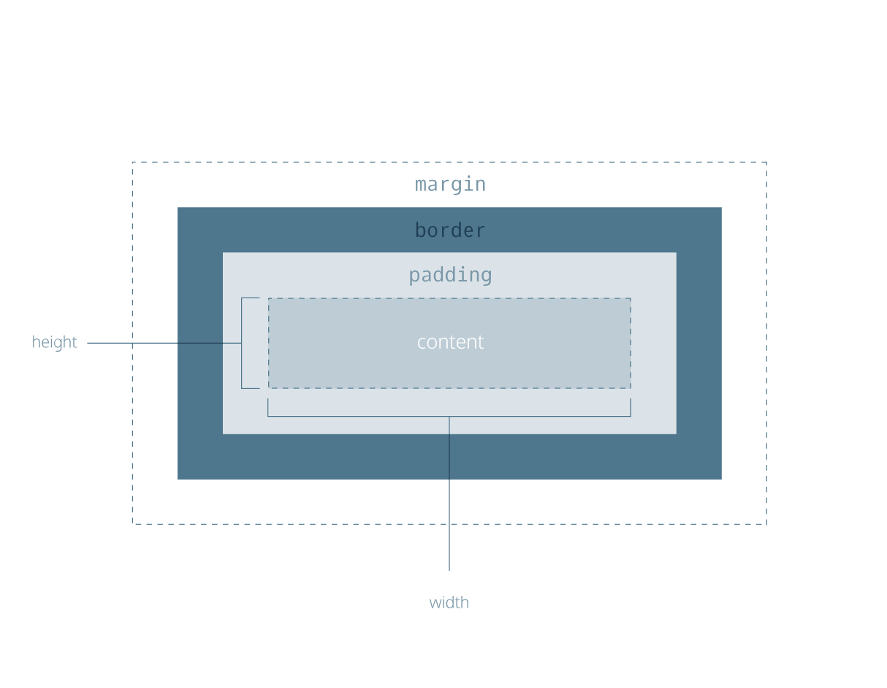

# Color 

* color - this property styles an element’s foreground color.
* background-color - this property styles an element’s background color.

```
selector | class | id {
  color: 'black';
  color: #000000;
  color: rgb(0,0,0);
  color: hsl(0,%,%); // hue saturation lightness 
  color: hsla(34, 100%, 50%, 0.1); //a , opacity
}
```

# Typography

fonts.google.com

```
selector | class | id {
  font-family:;
  font-weight:bold|normal|300|800;
  font-style:italic;
  word-spacing: .05em;
  letter-spacing: .03em;
  text-transform: uppercase|lowercase;
  text-align:;
  line-height:;
}
```
import fonts directly into stylesheets with the @font-face property
```
@font-face {
  font-family: 'Space Mono';
  font-style: normal;
  font-weight: 700;
  src: local('Space Mono Bold'), local('SpaceMono-Bold'), url(https://fonts.gstatic.com/s/spacemono/v5/i7dMIFZifjKcF5UAWdDRaPpZUFWaHi6WZ3Q.woff2) format('woff2');
  unicode-range: U+0000-00FF, U+0131, U+0152-0153, U+02BB-02BC, U+02C6, U+02DA, U+02DC, U+2000-206F, U+2074, U+20AC, U+2122, U+2191, U+2193, U+2212, U+2215, U+FEFF, U+FFFD;
}
```

using @font-face with local fonts
```
@font-face {
  font-family: "Roboto";
  src: url(fonts/Roboto.woff2) format('woff2'),
       url(fonts/Roboto.woff) format('woff'),
       url(fonts/Roboto.tff) format('truetype');
}
```
e.g.
```
@font-face {
  font-family: "Glegoo";
  src: url(../fonts/Glegoo-Regular.ttf) format("truetype")
}


```

---

# Box Model
to understand how elements are positioned and displayed on a website.

* height
* width
* padding
* border
* margin
* overflow

<center></center>

* width and height
> specifies the width and height of the content area

* padding
> specifies amount of space between the content area and the border

* border
> specifies the thickness and style of the border surrounding the content area and padding

* margin
> specifies the amount of space between the border and the outside edge of the element

## Height and width 
element’s content has two dimensions: a height and a width
```
selector {
  height:px;
  width:px;
}
```
## Border
surround an elements 
```
selector {
  border: <width>px <style> none|dotted|solid <color>;
  border-radius: px | 100%; 
}
```
## Padding
space between contents and border 
```
selector {
  padding:;
  padding-top:;
  padding-right:;
  padding-bottom:;
  padding-left:;
  padding: top right bottom left;
}
```

## Margin
space directly outside the box , used to specify this space 
```
selector {
  margin: px;
  margin-top: ;
  margin-bottom: ;
  margin-right: ;
  margin-left: ;
}
```
* Margin
0 sets the top and bottom margins to 0 pixels, auto value instructs the browser to adjust the left and right margins until the element is centered within its containing element.
```
div {
  margin: 0 auto;
}

# In order to center an element, a width must be set for that element. Otherwise, the width of the div will be automatically set to the full width of its containing element

div.headline {
  width: 400px;
  margin: 0 auto;
}

```